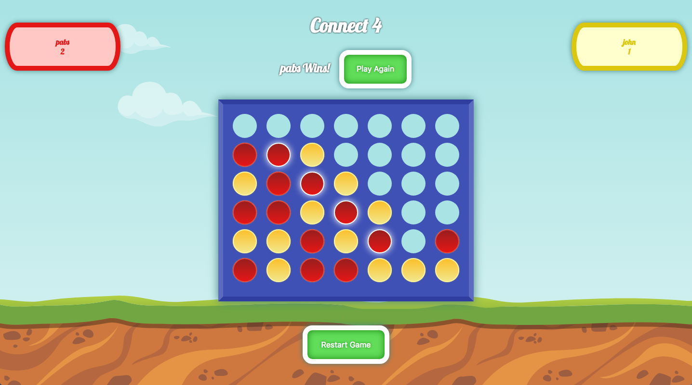

# Connect Four

This project was bootstrapped with [Create React App](https://github.com/facebookincubator/create-react-app)

> This is a React-Redux game that keeps track of the game state in the localStorage. Giving you the freedom of leaving in the middle of the game and come back later to keep playing.



## Tech/framework used

Built with:

- React
- Redux
- Mocha
- Vanilla CSS

## Development Setup

```sh
# In the project directory, you can run:

npm start

# Runs the app in the development mode.
# Open http://localhost:3000 to view it in the browser.

# The page will reload if you make edits.
# You will also see any lint errors in the console.

npm run build

# Builds the app for production to the build folder.
# It correctly bundles React in production mode and optimizes the build for the best performance.

# The build is minified and the filenames include the hashes.
# Your app is ready to be deployed!

npm test

# Runs all the Mocha tests.
```

## Credits

[Pablo Jurado](http://www.pablojurado.com).
